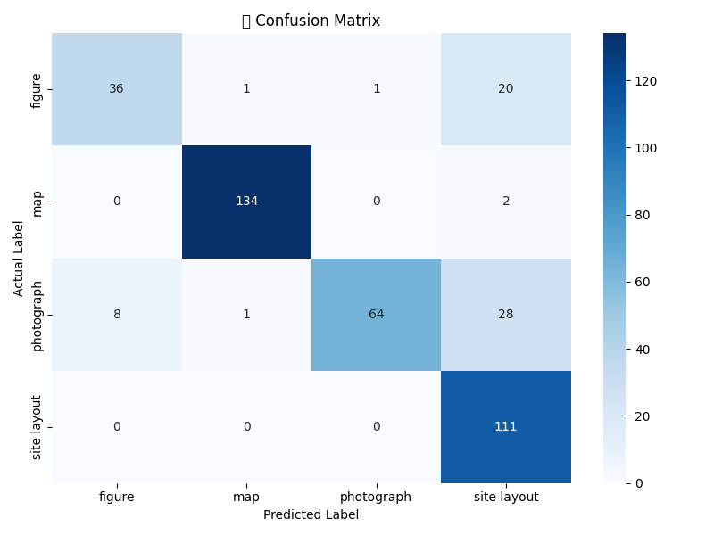

# CLIP Image Classifier (Map, Photograph, Site Layout, Figure)

This Python script uses OpenAI's CLIP model to classify images into one of the following categories:

- **Map**
- **Photograph**
- **Site Layout**
- **Figure**

### 📊 Classification Report  on [DATASET](https://drive.google.com/drive/folders/1eouIdtjQ57REbBbQ-jzHbCaBsHeYUWwP?usp=sharing)

| Class        | Precision | Recall | F1-Score | Support |
|--------------|-----------|--------|----------|---------|
| Figure       | 0.818     | 0.621  | 0.706    | 58.00   |
| Map          | 0.985     | 0.985  | 0.985    | 136.00  |
| Photograph   | 0.985     | 0.634  | 0.771    | 101.00  |
| Site Layout  | 0.689     | 1.000  | 0.816    | 111.00  |
| **Accuracy** |           |        | **0.850**| **—**   |

> **Overall Accuracy:** 85%

Tested the model on 408 images with these following classes(map, photograph, site layout, figure) 

102 images from each classes downloaded from google [Archeological Maps, Archeological Photograph, Archeological Site Layout, Archeological Figures(Drawings)] 

---

## 📦 Features

- Classifies images using CLIP (ViT-B/32).
- Supports batch processing of multiple images and folders.
- Optionally computes accuracy, classification report, and confusion matrix.
- Saves classification metadata and evaluation metrics as JSON files.

---
Here are two sample images used for classification:

### 🖼️ Map Image (`1.png`)

### 🗺️ Photograph Image (`2.png`)

### 🖼️ Site layout Image (`1.png`)

### 🗺️ Figure Image (`2.png`)

