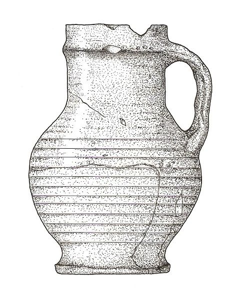

# CLIP Image Classifier (Map, Photograph, Site Layout, Figure)

This Python script uses OpenAI's CLIP model to classify images into one of the following categories:

- **Map**
- **Photograph**
- **Site Layout**
- **Figure**

It also supports accuracy evaluation using ground truth labels and saves detailed metadata for each classification run.

---

## 📦 Features

- Classifies images using CLIP (ViT-B/32).
- Supports batch processing of multiple images and folders.
- Optionally computes accuracy, classification report, and confusion matrix.
- Saves classification metadata and evaluation metrics as JSON files.

---
Here are two sample images used for classification:

### 🖼️ Map Image (`1.png`)

.jpg)

### 🗺️ Photograph Image (`2.png`)

.jpg)

### 🖼️ Site layout Image (`1.png`)

.jpg)

### 🗺️ Figure Image (`2.png`)

These images are used for testing the classifier and should be correctly identified as `figure` and `map` respectively.

